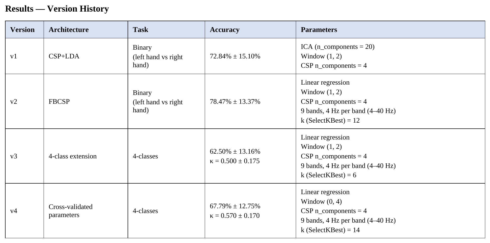
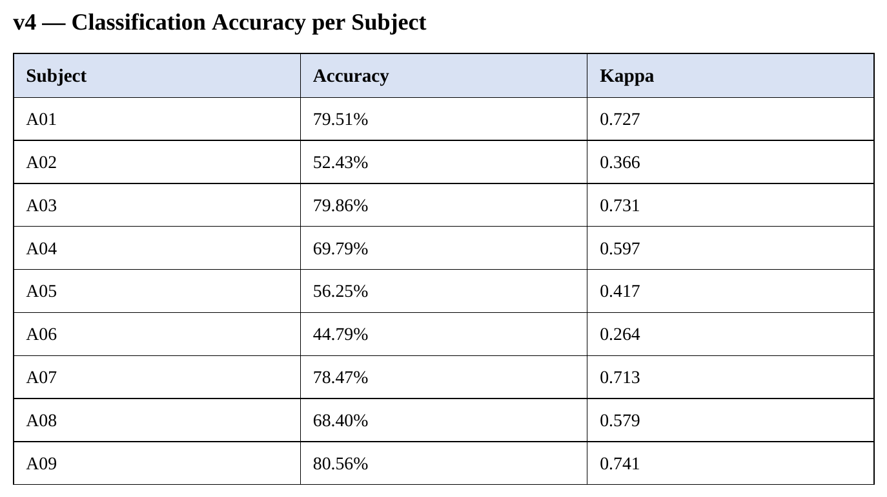
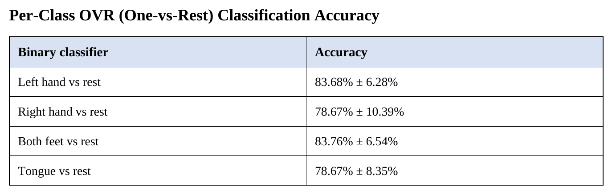
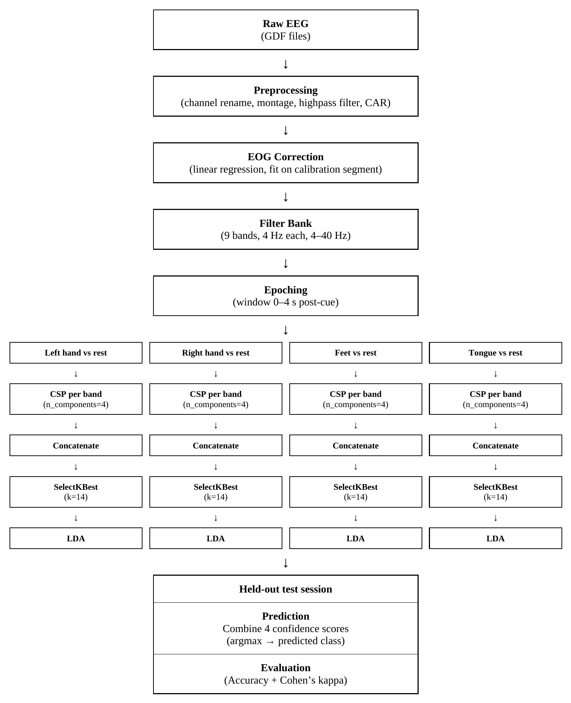
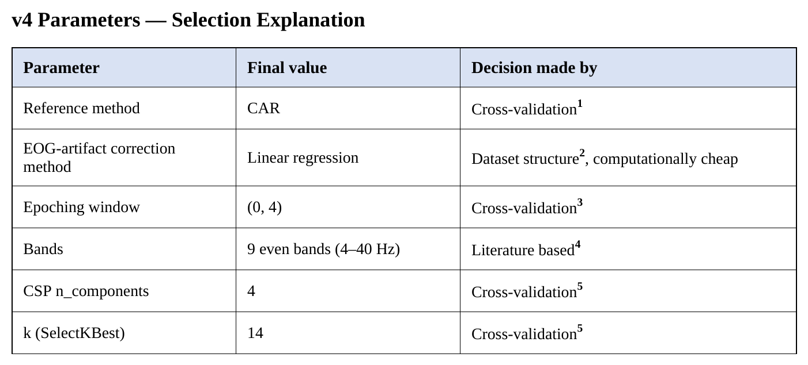

# Non-causal FBCSP + LDA pipeline for 4-class motor imagery classification on BCI Competition IV, Dataset 2a

Dataset documentation:
 https://www.bbci.de/competition/iv/desc_2a.pdf

## I) Overview:

•	Author background: epileptologist, neurologist with extensive EEG interpretation experience, self-taught in Python/MNE/ML for this project.

•	Progression: single-band CSP+LDA → FBCSP → 4-class OVR extension → fully cross-validated pipeline.

•	Final result: κ = 0.570 ± 0.170, matching the original BCI Competition IV 1st-place entry (Ang et al., κ = 0.57).

## II) Repository Structure
```
motor-imagery-bci-iv-2a/
├── README.md
├── environment.yml
├── LICENSE
├── .gitignore
├── images
└── notebooks/
        ├── pipeline.ipynb                       # main, final pipeline (v4, cross-validated parameters)
        └── archive/
                ├── pipeline_v1_csp_lda.ipynb                                # v1  (CSP+LDA)
                ├── pipeline_v2_fbcsp.ipynb                                  # v2  (FBCSP)
                └── pipeline_v3_4-class_extension.ipynb                      # v3  (4 class-extension)       
```
## III) Results



v1 – v3 are preserved to document the project's methodological progression, they were not re-run with later findings (optimal parameter values were found later through cross-validation)

Comparison to BCI Competition IV official rankings (kappa): https://www.bbci.de/competition/iv/results/#dataset2a 

** this project v4:   0.57 **

Official competition rankings:
- 1st  place (Kai Keng Ang):   0.57
- 2nd place (Liu Guangquan):   0.52 
- 3rd place (Wei Song):   0.31
- 4th place (Damien Coyle):   0.30
- 5th place (Jin Wu):   0.29



Subjects A02 and A06 showed consistently lower classification performance across all tested pipelines (binary CSP, FBCSP, and 4-class extension). Subject A05's performance varied notably by architecture: results in v1, v3, and v4 were below average, while v2 (FBCSP) performed above average for this subject.



Individual OVR classifier accuracy (each class vs. the other three combined) included to show relative separability across classes. Left hand and feet classes show higher individual separability than right hand and tongue.

## IV) Methodology 



## V) Parameters choice and cross-validation.



1. Candidates: original mastoid reference, CAR, CSD.  
Cross-validation performed on v1 architecture without ICA.

2. Block for EOG estimation at the beginning of each session.
   
3. Candidates: all possible integer variations.  
Cross-validation performed on v1 architecture without ICA.

4.	Ang et al., 2012

5. n_components and k were cross-validated jointly to find the best combination  
Candidates CSP n_component: 2, 4, 6, 8.  
Candidates k (SelectKBest): 2, 4, 6, 8, 10, 12, 14.  
Cross-validation performed on v3 architecture with window (0, 4)


Before v4, all parameters were chosen either by literature/MNE official guidelines, or empirically, based on test-set performance. Cross-validation was finally performed to select montage, epoching window, CSP n_components, and k (SelectKBest).
Montage and epoching window were cross-validated separately, on v1's architecture without ICA (computationally cheaper). 
n_components and k were cross-validated jointly, to find the best combination, on v3's architecture with epoching window (0, 4).

#### 1) EOG-artifact correction method
   
Initially, in v1, ICA (n_components = 20, threshold = 3.0) was chosen as the EOG-artifact correction method. It was later replaced with linear regression, which gave faster computation with almost the same accuracy. In addition, the dataset's experimental design (with a separate EOG-evaluation block) itself suggests linear regression over ICA as the more natural choice 
Several ICA and linear regression variants were empirically (based on test-set performance) tested on the v1 architecture: five threshold values (3.0 - 4.5) for ICA, and three fitting strategies for linear regression - raw signal over the full record, calibration period, evoked-subtraction. No method produced a meaningful, defensible improvement over uncorrected data (75.5%): ICA's best result (76.0%, threshold = 4.0) and the regression variants (clustered around 75.0–75.5%). Standard ICA threshold = 3 performed slightly worse, possibly due to overcorrection. The slight differences between the various approaches can likely be explained by a physiological factor: EOG artifacts are predominantly slow-wave activity, most of which is already excluded before EOG correction is even applied, by the pipeline's 1 Hz highpass filter.
In v4, the linear regression fitting approach was slightly refined. First, more flexibility was added to the calibration period, since, for example, subject A04's EOG calibration block is shorter due to a technical issue during recording. Second, fitting was restricted to the eye-movement and eyes-open segments, since trials themselves involve motor imagery performed with eyes open. Eyes-closed segments were excluded from calibration fitting, both for numerical stability (low EOG variance) and to avoid fitting the regression on a period with weak, potentially spurious EOG-EEG correlations that could risk overcorrection.

#### 2) BAD rejection
   
Expert-marked artifact rejection was tested on both single-band CSP (where it produced a substantial accuracy drop when correctly excluded, 75% -> 62%) and on FBCSP (where the same comparison showed minor difference, 78.47% vs. 77%). Given the added implementation complexity (the number of trial epochs no longer matches the number of labels after BAD rejection) and minimal benefit for the final FBCSP-based architecture, artifact rejection was not used in the final pipeline.

#### 3) SelectKBest
   
SelectKBest with mutual_info_classif - implements the paper's (Ang et al., 2008) MIBIF (Mutual Information-based Best Individual Feature) feature selection concept.

## VI) Limitations

- Epoching window and reference method were cross-validated on the v1 architecture without ICA, due to time constraints
- A minor kappa discrepancy was observed across two different machines running the same code, likely due to differing library versions. environment.yml at the root of the repository provides near-exact reproducibility for v1-v4
  
## VII) Future work

- Window and reference method cross-validation on the final (v4) architecture.
-  Continued exploration of artifact-correction methods. 
- ERD/ERS visualization, feature/CSP topomaps, and other exploratory plotting options. 
-  Deep learning architectures for classification (e.g., EEGNet, FBCNet).
  
## VIII) Literature references:

1.	Brunner C, Leeb R, Müller-Putz GR, Schlögl A, Pfurtscheller G. BCI Competition 2008 – Graz data set A. Graz University of Technology; 2008.
2.	Pfurtscheller G, Neuper C, Guger C, Harkam W, Ramoser H, Schlögl A, Obermaier B, Pregenzer M. Current trends in Graz Brain-Computer Interface (BCI) research. IEEE Trans Rehabil Eng. 2000 Jun;8(2):216-9. doi: 10.1109/86.847821. PMID: 10896192.
3.	Pfurtscheller G, Neuper C. Motor imagery and direct brain-computer communication. Proc IEEE. 2001;89(7):1123-1134. doi:10.1109/5.939829
4.	Blankertz B, Tomioka R, Lemm S, Kawanabe M, Müller KR. Optimizing spatial filters for robust EEG single-trial analysis. IEEE Signal Process Mag. 2008;25(1):41-56. doi:10.1109/MSP.2008.4408441
5.	Ang KK, Chin ZY, Zhang H, Guan C. Filter bank common spatial pattern (FBCSP) in brain-computer interface. Proceedings of the 2008 IEEE International Joint Conference on Neural Networks (IEEE World Congress on Computational Intelligence); 2008 Jun 1-8; Hong Kong, China. p. 2390-2397. doi:10.1109/IJCNN.2008.4634130
6.	Ang KK, Chin ZY, Wang C, Guan C, Zhang H. Filter Bank Common Spatial Pattern Algorithm on BCI Competition IV Datasets 2a and 2b. Front Neurosci. 2012 Mar 29;6:39. doi:10.3389/fnins.2012.00039. PMID: 22479236; PMCID: PMC3314883.
   
## IX) Documentation references

#### MNE official guidelines:

•	Overview of MEG/EEG analysis with MNE-Python  
https://mne.tools/stable/auto_tutorials/intro/10_overview.html 

•	The Raw data structure: continuous data  
https://mne.tools/stable/auto_tutorials/raw/10_raw_overview.html

•	Working with events  
https://mne.tools/stable/auto_tutorials/raw/20_event_arrays.html 

•	Overview of artifact detection  
https://mne.tools/stable/auto_tutorials/preprocessing/10_preprocessing_overview.html

•	Filtering and resampling data  
https://mne.tools/stable/auto_tutorials/preprocessing/30_filtering_resampling.html

•	Repairing artifacts with ICA  
https://mne.tools/stable/auto_tutorials/preprocessing/40_artifact_correction_ica.html

•	Repairing artifacts with regression  
https://mne.tools/stable/auto_tutorials/preprocessing/35_artifact_correction_regression.html

•	Setting the EEG reference  
https://mne.tools/stable/auto_tutorials/preprocessing/55_setting_eeg_reference.html

•	The Epochs data structure: discontinuous data  
https://mne.tools/stable/auto_tutorials/epochs/10_epochs_overview.html

•	Motor imagery decoding from EEG data using the Common Spatial Pattern (CSP)  
https://mne.tools/stable/auto_examples/decoding/decoding_csp_eeg.html

#### MNE API:  
https://mne.tools/stable/api/python_reference.html 

#### Scikit-learn API:  
https://scikit-learn.org/stable/api/index.html 

•	SelectKBest  
https://scikit-learn.org/stable/modules/generated/sklearn.feature_selection.SelectKBest.html 

